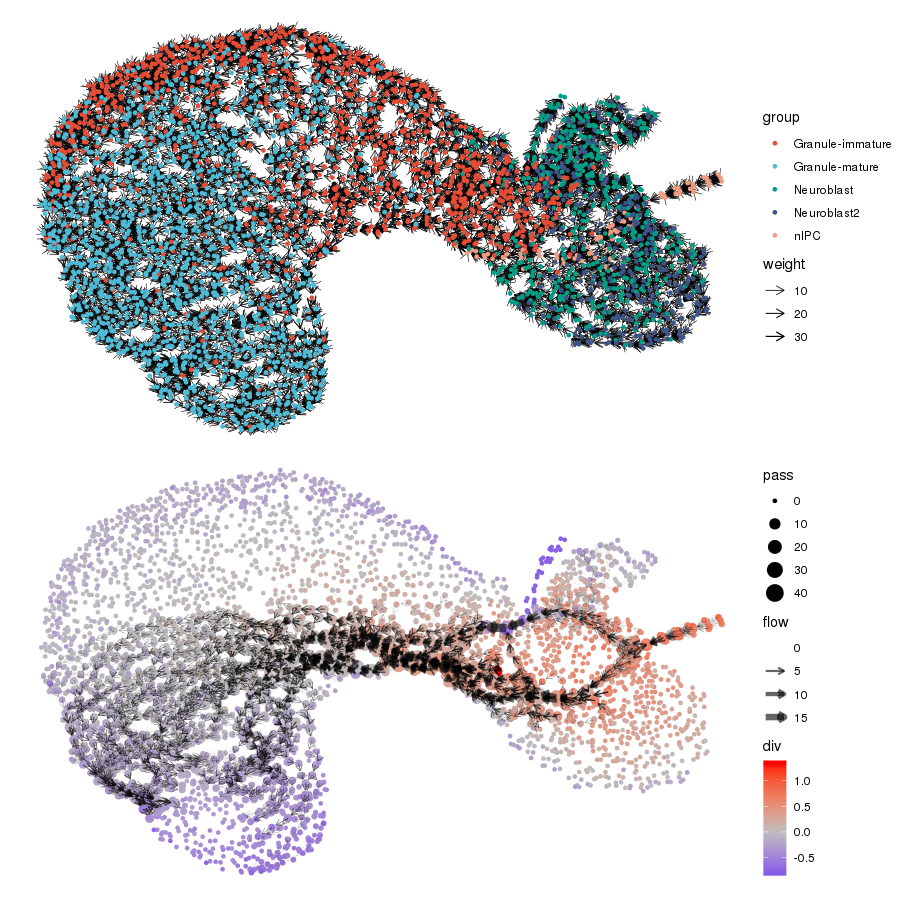

<!-- README.md is generated from README.Rmd. Please edit that file -->

```{r setup, include = FALSE}
knitr::opts_chunk$set(
  collapse = TRUE,
  comment = "#>",
  fig.path = "man/figures/README-",
  out.width = "100%"
)
```

# ddhodge

The goal of ddhodge is to be a toolkit to analyse underlying "flow" structure (e.g., time or causal relations) in the *hodge-podge* collection of data points. ddhodge will help to interpret/visualize the large data sets including, but not limited to, high-throughput measurements of biological data (e.g., single-cell RNA-seq) which we mainly focus on. 

ddhodge is built on a mathematical framework of Hodge decomposition on simplicial complex that gives us fruitful analogy of gradient, curl and harmonic (cyclic) flows on manifold. ddhoge can thus potentially handles any (both of acyclic and cyclic) directed graph structure.

The first version of this package implements `diffusionGraph` as a design of edges. The resulting graph consists of sparse gradient flows (i.e. pure directed acyclic graph) and is suitable to sketch out the ideas from a simplified flow network.

Installation
------------

You can install the alpha version of `ddhodge` with:

``` r
devtools::install_github("kazumits/ddhodge")
```

Methods
-------

Please refer to our preprint.

* Modeling latent flows on single cell data using the Hodge decomposition <https://doi.org/10.1101/592089>

Example
-------

This is a basic example which shows you how to dissect the pseudo-time flow, which we define here as a potential flow (defined through diffusion process), of the single-cell RNA-seq data. ddhodge can further extract and visualize *sink* and *source* information as a divercence of the extracted flow.

#### Load packages

Please confirm that these packages are installed before trying this example.

``` {r loadLibs, message=FALSE}
library(ddhodge)
library(dplyr)
library(readr)
library(ggsci)
library(ggraph)
```

#### Load scRNA-seq data

Load data of from [GSE6731](https://www.ncbi.nlm.nih.gov/geo/query/acc.cgi?acc=GSE67310) (Treutlein et. al., 2016).

```{r loadData, cache=TRUE, message=FALSE}
dat <- read_tsv("https://www.ncbi.nlm.nih.gov/geo/download/?acc=GSE67310&format=file&file=GSE67310%5FiN%5Fdata%5Flog2FPKM%5Fannotated.txt.gz") %>% filter(assignment!="Fibroblast") 
group <- with(dat,setNames(assignment,cell_name))
X <- dat[,-(1:5)] %>% as.matrix %>% t
# revert to FPKM and drop genes with var.=0
X <- 2^X[apply(X,1,var)>0,] - 1 
```


#### The ddhodge part

Specify input data matrix (raw UMI counts) and the indices of starting cells (roots).

```{r doddhodge}
g <- diffusionGraph(X,group=="MEF",k=7,npc=100,ndc=40,s=2)
```


#### Visualizations

```{r drawGraph, fig.width=8, fig.height=6}
dggraph <- function(g,...)
  ggraph(g) + theme_void() +
  geom_edge_link(
    aes(width=weight),
    colour="black",
    arrow=arrow(length=unit(2.4,"mm")),
    end_cap = circle(1.2,'mm'),
  ) + scale_edge_width(range=c(0.2,0.5)) +
  geom_node_point(...)

igraph::V(g)$group <- group
# stress layout gives a nice visualization for >1k cells
lo <- create_layout(g,"stress")

p1 <- dggraph(lo,aes(colour=group),size=2) +
  ggtitle("Sparse reconstruction of diffusion process (k=7)") +
  scale_color_d3("category10")

p2 <- dggraph(lo,aes(colour=div),size=3) +
  ggtitle("Divergence tells us the source and sink.") +
  scale_color_gradient2(low="blue",mid="grey",high="red")

p3 <- dggraph(lo,aes(colour=u),size=2) +
  ggtitle("Potential is considered to be a pseudo-time.") +
  scale_color_viridis()

p4 <- create_layout(g,"tree") %>%
  dggraph(aes(colour=group),size=2) +
  ggtitle("Tree layout is possible because the flow is purely DAG.") +
  scale_color_d3("category10")

print(list(p1,p2,p3,p4))
```

Here is the another application to the large cell number of 10X Chromium data by Hochgerner et al. (Nature Neuroscience, 2018) with the parameters: `group=="nIPC",k=7,npc=100,ndc=40,s=3`.



The count matrix was downlowded from <https://zenodo.org/record/1443566>.

### Max-flow

Max-flow algorithm can be used to extract main/sub-streams between the specified source-sink clusters.

```{r maxflow, fig.width=8, fig.height=6}
g <- multimaxflow(g,which(group=="MEF"),which(group=="Neuron")[10:15])
#g <- multimaxflow(g,which(group=="MEF"),which(group=="Myocyte")[10:15])
ggraph(g,"stress") + theme_void() +
  geom_node_point(aes(colour=group,size=pass)) +
  geom_edge_link(
    aes(width=flow),
    colour="black",
    arrow=arrow(length=unit(1.8,"mm")),
    end_cap = circle(1.2,'mm'), alpha=0.6,
) + scale_edge_width(range=c(0,3)) + scale_color_d3("category10")
```


TODO
----

* Add more appealing demos and documentations
* Construction of causal and cyclic flows
* Pseudo-dynamics reconstruction using extracted pseudo-time structures
