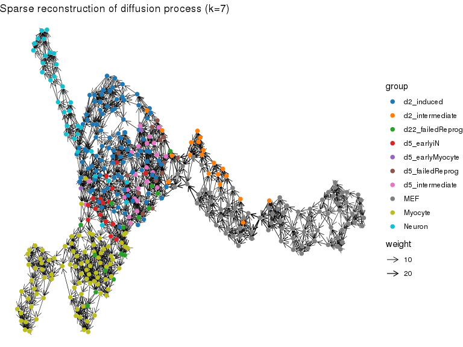
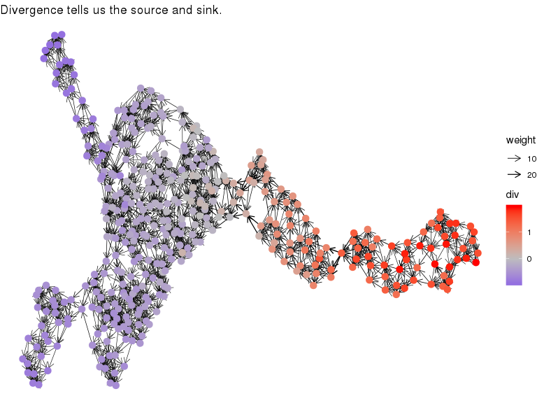
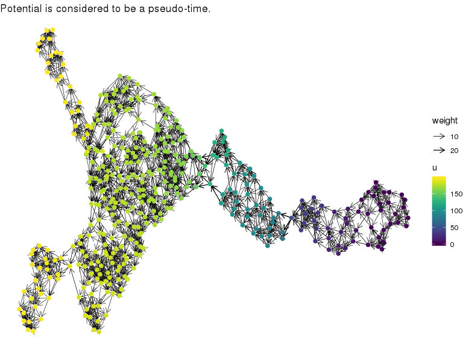

<!-- README.md is generated from README.Rmd. Please edit that file -->
ddhodge
=======

*Modeling Latent Flow Structure using Hodge Decomposition*

The goal of ddhodge is to be a toolkit to analyse a underlying "flow" structure (e.g., time or causal relations) in the *hodge-podge* collection of data points. ddhodge will help to interpret/visualize the large data sets including, but not limited to, high-throughput measurements of biological data (e.g., single-cell RNA-seq) which we mainly focus on.

ddhodge is built on a mathematical framework of Hodge decomposition on simplicial complex that gives us fruitful analogy of gradient, curl and harmonic (cyclic) flows on manifold. ddhoge can thus potentially handles any (both of directed acyclic and cyclic) graph structure; however, the first version of this package implements only `diffusionGraph` which is a potential flow (directed acyclic graph).

Installation
------------

You can install the alpha version of `ddhodge` with:

``` r
devtools::install_github("kazumits/ddhodge")
```

Methods
-------

*In preparation*

Example
-------

This is a basic example which shows you how to dissect the pseudo-time flow, which we define here as a potential flow (through diffusion maps), of the single-cell RNA-seq data by Treutlein et. al.. ddhodge can further extract and visualize *sink* and *source* information as a divercence of the extracted flow.

### Load packages

Please confirm that these packages are installed before trying this example.

``` r
library(ddhodge)
library(dplyr)
#> 
#> Attaching package: 'dplyr'
#> The following objects are masked from 'package:stats':
#> 
#>     filter, lag
#> The following objects are masked from 'package:base':
#> 
#>     intersect, setdiff, setequal, union
library(readr)
library(ggsci)
library(ggraph)
#> Loading required package: ggplot2
```

#### Load scRNA-seq data

Load data of from [GSE6731](https://www.ncbi.nlm.nih.gov/geo/query/acc.cgi?acc=GSE67310) (Treutlein et. al., 2016).

``` r
dat <- read_tsv("https://www.ncbi.nlm.nih.gov/geo/download/?acc=GSE67310&format=file&file=GSE67310%5FiN%5Fdata%5Flog2FPKM%5Fannotated.txt.gz")
#> Parsed with column specification:
#> cols(
#>   .default = col_double(),
#>   cell_name = col_character(),
#>   assignment = col_character(),
#>   experiment = col_character()
#> )
#> See spec(...) for full column specifications.
group <- dat %>% filter(assignment!="Fibroblast") %>%
  with(setNames(assignment,cell_name))
X <- dat %>% filter(assignment!="Fibroblast") %>%
  dplyr::select(-(1:5)) %>% as.matrix %>% t
# revert to FPKM and drop genes with var.=0
X <- 2^X[apply(X,1,var)>0,]-1 
```

#### The ddhodge part

Specify input data matrix and roots (starting points).

``` r
g <- diffusionGraph(X,group=="MEF",k=30,lambda=1e-4)
```

#### Drawings

``` r
# visualization using ggraph package
set.seed(33) 
igraph::V(g)$group <- group
lo <- create_layout(g,"nicely")

ggraph(lo) + ggtitle("Gradient") + theme_void() +
  geom_edge_link(
    aes(width=weight),
    colour="black",
    arrow=arrow(length=unit(1.2,"mm")),
    end_cap = circle(1.2,'mm'), alpha=0.33,
  ) + scale_edge_width(range=c(0.2,0.8)) +
  geom_node_point(aes(colour=group),size=2) +
  scale_color_d3("category20")
```



``` r

ggraph(lo) + ggtitle("Divergence") + theme_void() +
  geom_edge_link(
      aes(width=weight),
      colour="black",
      arrow=arrow(length=unit(1.2,"mm")),
      end_cap = circle(1.2,'mm'), alpha=0.33,
  ) + scale_edge_width(range=c(0.2,0.8)) +
  geom_node_point(aes(colour=div,size=div^2)) +
  scale_color_gradient2(low="blue",mid="grey",high="red")
```



``` r

ggraph(lo) + ggtitle("Potential") + theme_void() +
  geom_edge_link(
      aes(width=weight),
      colour="black",
      arrow=arrow(length=unit(1.2,"mm")),
      end_cap = circle(1.2,'mm'), alpha=0.33,
  ) + scale_edge_width(range=c(0.2,0.8)) +
  geom_node_point(aes(colour=u),size=2) +
  scale_color_viridis()
```



TODO
----

-   Add more examples and documentations
-   Extracting nodes along specified paths (e.g., from source to sink)
-   Assessing cluster-to-cluster flow for coarse-grained interpretation of data
-   Construction of causal graph structure including cyclic flows
-   Pseudo-dynamics reconstruction using extracted pseudo-time structures
